# 📄 Stone Skipping (물수제비 타ì�´ë°� 리듬 ì•¡ì…> **문서 버전**: v2.3.0 (Approved - BG_01 루트 1,500m 통합 스트리ë°�, ë�™ì � 4단계 환경 ë�¼ì�´íŒ…, ë ˆì�´ìº�스트 ê°•í�­ ì��ë�™ê°�지 & ë�™ì � 수면 엔티티 ì�¬ìŠ¤í�° 완료)  
> **엔진 � 대� 플��**: Unity 6 (6000.5.8f1) / Windows Standalone (PC) / Android (APK) / iOS (Xcode)  
> **화면 모드**: 모바� 세로 9:16 (Portrait) 고정 최�화  
> **깃허브 저�소 루트**: `d:\Git_Hub\Test_AI` (Subfolder: `Test_AI`)

---

## 1. � 게� 개요 � 핵심 플레� 루프

### 1.1 게� 개요
- **타�틀**: Stone Skipping (물수제비 마스터 3D)
- **핵심 �미**: 완벽한 ��와 파워로 �� �진 후, 수면� 닿는 찰나마다 칼타�� 리듬 터치로 �없� �약하며 마지막 **'�로�~' 스키� 피니시**까지 연결�는 짜릿한 �맛(사운드+햅틱 진�) 제공

```mermaid
flowchart TD
    P0["0단계: 투구 위치 선정\n(�거리 발� / PP01~PP29 강변 ��)"] --> P1["1단계: �� 조준\n(좌우 스윙 게�지)"]
    P1 --> P2["2단계: 파워 충전\n(�하 와�드업 파워 바)"]
    P2 --> P3["3단계: 리듬 액션 바운스\n(다�내믹 Y-바운스 쿼터뷰 / 풀스�린 탭 / 사운드 & 햅틱)"]
    P3 --> P4["4단계: '�로�~' 스키� 피니시\n(5스킵 �� 시 수면 고� 활주 보너스)"]
    P4 --> P5["5단계: 탑다운 ��(Orthographic) 궤� 리플레�\n(전체 궤� 맵 �� 프레�� / 파문 애니메�션)"]
    P5 --> P6["6단계: 최종 결과 정산 � 보�\n(거리/스킵/타겟/�� �수 집계)"]
    P6 --> P0
```

---

## 2. 🕹� 2가지 게� 모드 사양

### 2.1 � 모드 1: �거리 기� 경신 모드 (Long Distance Mode)
- **시� 위치**: 수� 나무 발�(`Lakeside_WoodenPier`) 위 좌우 ��
- **투구 방향**: 월드 `+Z`축 물줄기 방향 (1,500m 릴레� 무한 강줄기 코스)
- **목표**: 최�� ��와 리듬 터치로 최대 스킵 횟수 � �달 거리 기� 경신
- **수면 환경**: 5열 레�(-18m, -9m, 0m, 9m, 18m)� 따� 가� 부스트 패드, �애물 바위, �핑 물고기, 친구 기� 깃발 배치

### 2.2 � 모드 2: 타겟 �추기 / 물 건너� 투구 모드 (Target Accuracy Mode)
- **시� 위치**: 강변� 따� �연 정렬� `PP01` ~ `PP29` 웨���트([PlayerPositionPath.cs](file:///d:/Git_Hub/Test_AI/Test_AI/Assets/Scripts/Gameplay/PlayerPositionPath.cs)) 중 선�
- **시� 연출**:
  - **메� 뷰**: �릭터 숄� 뷰 & 3D 쿼터뷰
  - **�단 PIP 뷰**: `Ground` 지형 메쉬� �� 피팅� ��(Orthographic) 탑다운 맵 카메�([MapPIPManager.cs](file:///d:/Git_Hub/Test_AI/Test_AI/Assets/Scripts/Visuals/MapPIPManager.cs))
- **투구 방향**: 강 건너� (`+X`축)
- **목표**: 수면 전역� 떠 �는 **플로팅 타겟 과� �([FloatingTargetZone.cs](file:///d:/Git_Hub/Test_AI/Test_AI/Assets/Scripts/Gameplay/FloatingTargetZone.cs))** � 명중시켜 대량� 보너스 �수 ��

---

## 3. 🌄 1,500m 무한 스트리� & �� 환경 ��팅 시스템

### 3.1 `BG_01` 루트 통합 2-청� 스트리� ([LakeEnvironmentManager.cs](file:///d:/Git_Hub/Test_AI/Test_AI/Assets/Scripts/Visuals/LakeEnvironmentManager.cs))
- **통합 청� 단위**: `BG_01` (지형 `Ground` + 수면 `Water_Surface` + 좌/우 산맥 `Left/Right_Mountains`)를 하나� 청�(1,500m)로 취급
- **A-B 핑� 릴레�**: �본(`BG_01`, 0~1500m)과 복제본(`BG_01_Chunk1`, 1500~3000m)� 번갈아 순간�� 배치
- **트리거 시�**: �/카메�가 뒷 청� 기준 `1,000m`를 통과하는 순간 뒷 청�를 �쪽(`+3,000m`)으로 ��
- **릴레� �벤트 콜백 (`OnChunkRelayed`)**: 지형� �으로 ��할 때 �벤트를 발행하여 `RiverSpawner`가 새로 �성� 1,500m 수면 구간� 엔티티를 �� �스�

### 3.2 0m ~ 4,500m+ 4단계 �� 환경 ��팅 (Dynamic Journey Lighting)
거리 비례 실시간 `Lerp` 보간으로 �연스러운 시간� �름(낮 $\rightarrow$ 노� $\rightarrow$ 밤) 연출:

| 비거리 구간 | 테마 �름 | 주 조명(Sun Light) | 스카�박스/안개(Fog) | 산맥 틴트 |
| :--- | :---: | :---: | :---: | :---: |
| **0m ~ 1,500m** | ☀� **ClearDay** | $48^\circ$, �� 온백색 (1.45 Lux) | 청명한 스카�블루 / 연한 블루 안개 | 청�빛 실루엣 |
| **1,500m ~ 3,000m** | 🌅 **Sunset** | $16^\circ$, 황금빛 오렌지 (1.55 Lux) | 짙� 노� 주황 / 노� 안개 | 보�빛 노� 산 |
| **3,000m ~ 4,500m** | 🌆 **Twilight** | $6^\circ$, 붉� �양 (1.15 Lux) | 땅거미 마젠타 / �양 안개 | 짙� 다� 바�올렛 |
| **4,500m+** | 🌙 **MoonlitNight** | $-25^\circ$, ��한 달빛 (0.45 Lux) | 달빛 네�비 / 딥 블루 안개 | 칠�빛 밤하늘 실루엣 |

---

## 4. 🌊 �� 수면 엔티티 스� & 레��스트 물리 검� ([RiverSpawner.cs](file:///d:/Git_Hub/Test_AI/Test_AI/Assets/Scripts/Gameplay/RiverSpawner.cs))

- **강� �� �지 (`GetWaterXBounds`)**: `WaterSurface`� BoxCollider 너비를 �어와 수면 �� �춰 좌우 스� 범위 �� ��
- **수� 물리 레��스트 (`IsValidWaterPosition`)**:
  - 스� 후보 지� �공($Y=+20\text{m}$)�서 아�로 수� Raycast 발사
  - 수면($Y=0\text{m}$)보다 높� 지형($Y>0.3\text{m}$)� 먼저 닿으면 스�� 즉시 취소하여 **지형 관통 � 땅� 스� �천 차단**
- **청� �� �스� (`SpawnChunkEntities`)**:
  - `LakeEnvironmentManager.OnChunkRelayed` 콜백 발� 시 호출
  - 새로 �성� `chunkStartZ ~ chunkStartZ + 1500m` 구간� 지나간 오브�트를 청소하고, 새 수면� 부스트 패드, �애물 바위, 물고기, 연� 군�� �� �배치

---

## 5. 🪨 스톤 물리 � �릭터 애니메�션 파�프��

### 5.1 3D 프리팹 모� 연� ([SkippingStone.cs](file:///d:/Git_Hub/Test_AI/Test_AI/Assets/Scripts/Gameplay/SkippingStone.cs))
- **0� 초기화 프리팹(`Assets/3D/prefab/Stone.prefab`) �스턴스화**: `localPosition = Vector3.zero`, `localScale = Vector3.one`
- **콜��� �� �기화**: 프리팹 메쉬 바운드(`mesh.bounds.size` � `center`)를 �어와 `BoxCollider`로 1:1 �� 정렬 (납�한 조약� 형태와 100% �치)
- **조약� 전용 머티리얼([Stone_Pebble_Mat.mat](file:///d:/Git_Hub/Test_AI/Test_AI/Assets/Resources/Stone_Pebble_Mat.mat))**:
  - 선명한 톤 � `Smoothness = 0.80` 반사광 �용, �스처 �체 가능

### 5.2 ✋ � 소켓 고정 & 스윙 릴리즈 ([StoneThrowerCharacter.cs](file:///d:/Git_Hub/Test_AI/Test_AI/Assets/Scripts/Gameplay/StoneThrowerCharacter.cs))
- **�미 소켓 회전 정렬**: `Dummy001` 소켓� Z축(전방)과 조약�� Y축(�단)� 1:1로 �치 정렬 (`Euler(90, 0, 0)`)
- **0~54프레� (와�드업 � 스윙 중)**: � 소켓 본� 매 프레� 위치/회전� 100% 찰싹 달�붙어 함께 휘둘러지�� 고정 (`isKinematic = true`)
- **55프레� 릴리즈 (발사 순간)**: �릭터 몸체 렌�러만 숨기고, 조약� 3D 메쉬 렌�러는 100% 활성화 �태 유지 (`isKinematic = false`, `useGravity = true`)
- **Y-Up 수� 유지 � 순수 Y축(Yaw) �전 회전**: 비행 중 Pitch(X)와 Roll(Z) 회전� 강제 고정(`FreezeRotationX | FreezeRotationZ`)하여 항� 납�한 면� 하늘� 향하�� 유지, �전 스핀� Y축(Yaw) $45\text{ rad/s}$ 고� 회전

---

## 6. � 프로시저럴 사운드 효과�(SFX) 시스템

### 6.1 9종 프로시저럴 오디오 �셋 ([SoundSynthesizer.cs](file:///d:/Git_Hub/Test_AI/Test_AI/Assets/Scripts/Audio/SoundSynthesizer.cs) & [SoundEffectGenerator.cs](file:///d:/Git_Hub/Test_AI/Test_AI/Assets/Editor/SoundEffectGenerator.cs))
수학� 파형 합성 알고리즘(PCM 16-bit Mono 44.1kHz)� 통해 외부 ��브러리 없� 9종� 전용 오디오 �셋� �성 � �착 완료:

1. 💨 **`Throw_Whoosh.wav`**: 시�하게 날아가는 �물선 바�소리 (화�트 노�즈 + 피치 스윕)
2. 🌊 **`Bounce_Water.wav`**: 맑고 찰진 수면 착수 �당� (삼�파 버블 모듈레�션)
3. ⚡ **`Bounce_Good.wav`**: 쫀�한 탄력 타격� (고조파 하모닉스)
4. 🔔 **`Bounce_Perfect.wav`**: PERFECT 타�� 저격 시 �롱한 4화� �리스탈 차�벨
5. � **`Skim_Slide.wav`**: 수면� 가르는 고� 활주 플러터 사운드 (28Hz �스)
6. 🚀 **`Boost_Pad.wav`**: 초고� 가� 레�저 워프 사운드 (톱니파 피치 스윕)
7. 💰 **`Coin_Jingle.wav`**: 물고기 저격 시 챠� 금화� (B5 $\rightarrow$ E6 2단 아르�지오)
8. 🫧 **`Stone_Sink.wav`**: 묵�한 꼬르륵 수중 침몰� (14Hz 저주파 버블�)
9. 🔘 **`Button_Click.wav`**: 촉��� UI 터치 �릭�

### 6.2 오디오 풀� & 모바� 최�화 ([AudioManager.cs](file:///d:/Git_Hub/Test_AI/Test_AI/Assets/Scripts/Audio/AudioManager.cs))
- **10채� 2D Direct AudioSource 풀�**: `spatialBlend = 0f`로 모바� 스피커/�어��서 선명하고 �치력 �는 출력 보�
- **피치 미세 무�위 변조 ($\pm 5\%$)**: 연� 바운스 시 귀 피로�를 줄�고 리얼한 연타 �맛 구현
- **`PlayOneShot` & `BeforeSceneLoad` 사전 로드**: 씬 전환 시 딜레� 없� 즉시 사운드 ��
- **AudioListener 단�화 가드**: `Map_Camera` 등� 중복 리스너를 비활성화하여 오디오 �소거 충� �천 차단

---

## 7. 📳 �로스플�� 네�티브 햅틱(진�) 시스템 ([HapticFeedbackHelper.cs](file:///d:/Git_Hub/Test_AI/Test_AI/Assets/Scripts/Audio/HapticFeedbackHelper.cs))

안드로�드 � iOS 환경�서 플레�어� 조� � 바운스 타��� 따� 세분화� 진� 피드백 제공:

| �황 | 진� 패턴 � 강� | 용� � 체� |
| :--- | :---: | :--- |
| **터치 / 조준 / 버튼 탭** | `15ms` (강� 80/255) | 미세한 햅틱 탭 피드백 |
| **�반 / GOOD 바운스** | `35ms` (강� 160/255) | 경쾌하고 쫀�한 수면 착수 타격� |
| **PERFECT 바운스 & 부스트** | `55ms` (강� 255/255 풀파워) | 묵�하고 짜릿한 최고 등급 �팩트 진� |
| **물� 침몰 (Sunk)** | `75ms` (강� 100/255) | 부드러운 수중 럼블 진� |

*유니티 `Handheld.Vibrate()` 내� fallback� 완비하여 구형 기기 � 모든 모바� 기기 100% 호환 보�.*

---

## 8. 🗺� ��(Orthographic) 탑다운 바운스 궤� 맵 리플레� ([TopDownReplayManager.cs](file:///d:/Git_Hub/Test_AI/Test_AI/Assets/Scripts/Visuals/TopDownReplayManager.cs))

### 8.1 시스템 �름
1. **1.5초 딜레� 진�**: � 침몰/착지 후 1.5초간 침몰 연출 �� $\rightarrow$ 메� 카메�가 하늘�서 수�(90�)으로 내려다보는 ��(Orthographic) 탑다운 뷰로 �� 전환
2. **전 구간 �� 화� 피팅 (Auto-Framing)**: 출발지�부터 최종 �착지�까지� 전체 거리를 계산하여 화면(세로 9:16)� � �게 `orthographicSize` �� 조절
3. **실시간 궤� 드로� & 착수� 파문 �**: 출발��서 시�하여 �� 날아간 실제 경로를 따� 발광 ��� 촤르륵 그려지며, � 바운스 지�마다 물결 파문 �과 등급 뱃지(START/PERFECT/GREAT/FINISH) 순차 �업

### 8.2 UI 버튼 �름
- **드로� 진행 중**: 하단 **`[스킵 (SKIP) �]`** 버튼 노출 $\rightarrow$ �릭 시 1프레� 만� 궤� 전체를 완성하고 즉시 최종 결과창으로 ��
- **드로� 완료 후**:
  - **`[다시 보기 ↺]`**: 궤�과 마커를 지우고 처�부터 다시 하나씩 그려나가는 �� 애니메�션 실행
  - **`[결과 보기 (완료) ✔]`**: 리플레�를 종료하고 카메�를 �복한 뒤 최종 결과창(�수/코� 정산) 표시

---

## 9. 📱 모바� 터치 반�성 & UI 시스템 ([StoneSkippingUI.cs](file:///d:/Git_Hub/Test_AI/Test_AI/Assets/Scripts/UI/StoneSkippingUI.cs))

- **720p 기준 가� 해�� 반�형 레�아웃**: 노치/카메� 홀(Safe Area) �� 계산
- **모바� �터치 반�성 (`GetPointerDownVirtualPos`)**: �가�� 화면� 닿는 첫 프레�(`pointerDownConsumedThisFrame`)� 즉시 버튼 �릭 �지 � 사운드/햅틱 트리거
- **모드 전환 시 터치 오�� 방지 (`requireTouchRelease`)**: 게� 오버 후 결과창�나 리플레� 화면�서는 불필요한 터치 � 없� 즉��� 버튼 탭 허용

---

## 10. 🚀 1�릭 멀티플�� 빌드 시스템 ([BuildPlayerHelper.cs](file:///d:/Git_Hub/Test_AI/Test_AI/Assets/Editor/BuildPlayerHelper.cs))

- **Windows Standalone (PC)**:
  - 메뉴: `Tools -> Build -> Build Windows Standalone (EXE)`
  - 세로 모바� 9:16 창모드 (540x960) �� 세팅 � 플�� 스위칭 지�
- **Android (Mobile)**:
  - 메뉴: `Tools -> Build -> Build Android (APK)`
  - 유니티 6 기본 런처(`UnityPlayerGameActivity`) 완벽 유지로 설치 시 **[열기] 버튼 � 홈 화면 앱 서� 아�콘 $100\%$ 정� 등�**
  - 최신 64비트 ARM64 � API Level 26+ 최�화
- **빌드 결과물 위치**: `d:\Git_Hub\Test_AI\Test_AI\Builds\` (빌드 완료 시 윈�우 �색기 �� 열림)

---

## 11. 🛡� 프로�트 아키�처 � 품질 보� 규칙

1. **Git 최�위 루트 규칙**: 진짜 깃 루트는 항� `D:\Git_Hub\Test_AI`�며 모든 `git add/commit/push`는 최�위�서 수행 ([git_root_structure.md](file:///d:/Git_Hub/Test_AI/Test_AI/.agents/rules/git_root_structure.md))
2. **사전 승� 후 코딩 규칙**: 질문/�� 리�트 시 분�� 먼저 제시하고 유저� 명시� 승� 후 코딩 진행 ([confirm_before_coding.md](file:///d:/Git_Hub/Test_AI/Test_AI/.agents/rules/confirm_before_coding.md))
3. **무결� 컴파� 검�**: 모든 코드 변경 후 `dotnet build Assembly-CSharp.csproj` � `Editor.csproj` **0 경고, 0 오류** 필수 통과
4. **회귀 분� 규칙**: 기능 �� 발� 시 �전 성공 시�과� 변경�� 비� 대조하여 �� 파악 ([diff_against_working_baseline.md](file:///d:/Git_Hub/Test_AI/Test_AI/.agents/rules/diff_against_working_baseline.md))
 |
| **PERFECT 바운스 & 부스트** | `55ms` (강� 255/255 풀파워) | 묵�하고 짜릿한 최고 등급 �팩트 진� |
| **물� 침몰 (Sunk)** | `75ms` (강� 100/255) | 부드러운 수중 럼블 진� |

*유니티 `Handheld.Vibrate()` 내� fallback� 완비하여 구형 기기 � 모든 모바� 기기 100% 호환 보�.*

---

## 6. 🗺� ��(Orthographic) 탑다운 바운스 궤� 맵 리플레� ([TopDownReplayManager.cs](file:///d:/Git_Hub/Test_AI/Test_AI/Assets/Scripts/Visuals/TopDownReplayManager.cs))

### 6.1 시스템 �름
1. **1.5초 딜레� 진�**: � 침몰/착지 후 1.5초간 침몰 연출 �� $\rightarrow$ 메� 카메�가 하늘�서 수�(90�)으로 내려다보는 ��(Orthographic) 탑다운 뷰로 �� 전환
2. **전 구간 �� 화� 피팅 (Auto-Framing)**: 출발지�부터 최종 �착지�까지� 전체 거리를 계산하여 화면(세로 9:16)� � �게 `orthographicSize` �� 조절
3. **실시간 궤� 드로� & 착수� 파문 �**: 출발��서 시�하여 �� 날아간 실제 경로를 따� 발광 ��� 촤르륵 그려지며, � 바운스 지�마다 물결 파문 �과 등급 뱃지(START/PERFECT/GREAT/FINISH) 순차 �업

### 6.2 UI 버튼 �름
- **드로� 진행 중**: 하단 **`[스킵 (SKIP) �]`** 버튼 노출 $\rightarrow$ �릭 시 1프레� 만� 궤� 전체를 완성하고 즉시 최종 결과창으로 ��
- **드로� 완료 후**:
  - **`[다시 보기 ↺]`**: 궤�과 마커를 지우고 처�부터 다시 하나씩 그려나가는 �� 애니메�션 실행
  - **`[결과 보기 (완료) ✔]`**: 리플레�를 종료하고 카메�를 �복한 뒤 최종 결과창(�수/코� 정산) 표시

---

## 7. 📱 모바� 터치 반�성 & UI 시스템 ([StoneSkippingUI.cs](file:///d:/Git_Hub/Test_AI/Test_AI/Assets/Scripts/UI/StoneSkippingUI.cs))

- **720p 기준 가� 해�� 반�형 레�아웃**: 노치/카메� 홀(Safe Area) �� 계산
- **모바� �터치 반�성 (`GetPointerDownVirtualPos`)**: �가�� 화면� 닿는 첫 프레�(`pointerDownConsumedThisFrame`)� 즉시 버튼 �릭 �지 � 사운드/햅틱 트리거
- **모드 전환 시 터치 오�� 방지 (`requireTouchRelease`)**: 게� 오버 후 결과창�나 리플레� 화면�서는 불필요한 터치 � 없� 즉��� 버튼 탭 허용

---

## 8. 🚀 1�릭 멀티플�� 빌드 시스템 ([BuildPlayerHelper.cs](file:///d:/Git_Hub/Test_AI/Test_AI/Assets/Editor/BuildPlayerHelper.cs))

- **Windows Standalone (PC)**:
  - 메뉴: `Tools -> Build -> Build Windows Standalone (EXE)`
  - 세로 모바� 9:16 창모드 (540x960) �� 세팅 � 플�� 스위칭 지�
- **Android (Mobile)**:
  - 메뉴: `Tools -> Build -> Build Android (APK)`
  - 유니티 6 기본 런처(`UnityPlayerGameActivity`) 완벽 유지로 설치 시 **[열기] 버튼 � 홈 화면 앱 서� 아�콘 $100\%$ 정� 등�**
  - 최신 64비트 ARM64 � API Level 26+ 최�화
- **빌드 결과물 위치**: `d:\Git_Hub\Test_AI\Test_AI\Builds\` (빌드 완료 시 윈�우 �색기 �� 열림)

---

## 9. 🛡� 프로�트 아키�처 � 품질 보� 규칙

1. **Git 최�위 루트 규칙**: 진짜 깃 루트는 항� `D:\Git_Hub\Test_AI`�며 모든 `git add/commit/push`는 최�위�서 수행 ([git_root_structure.md](file:///d:/Git_Hub/Test_AI/Test_AI/.agents/rules/git_root_structure.md))
2. **사전 승� 후 코딩 규칙**: 질문/�� 리�트 시 분�� 먼저 제시하고 유저� 명시� 승� 후 코딩 진행 ([confirm_before_coding.md](file:///d:/Git_Hub/Test_AI/Test_AI/.agents/rules/confirm_before_coding.md))
3. **무결� 컴파� 검�**: 모든 코드 변경 후 `dotnet build Assembly-CSharp.csproj` � `Editor.csproj` **0 경고, 0 오류** 필수 통과
4. **회귀 분� 규칙**: 기능 �� 발� 시 �전 성공 시�과� 변경�� 비� 대조하여 �� 파악 ([diff_against_working_baseline.md](file:///d:/Git_Hub/Test_AI/Test_AI/.agents/rules/diff_against_working_baseline.md))
