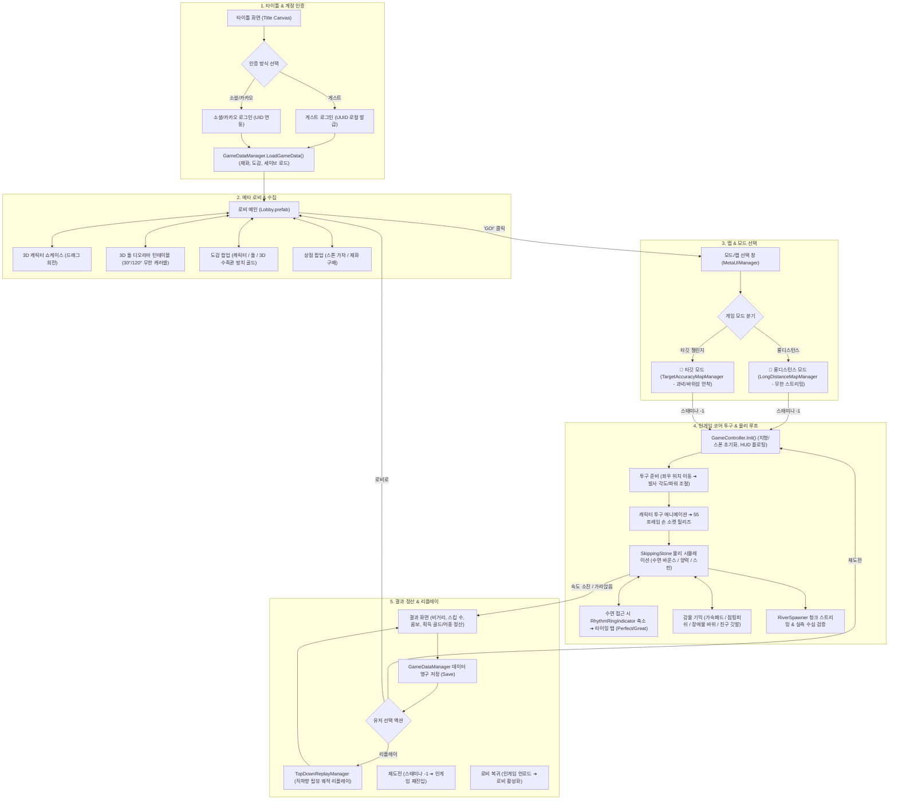
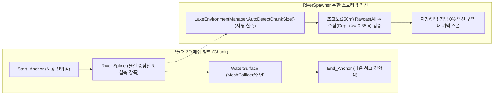
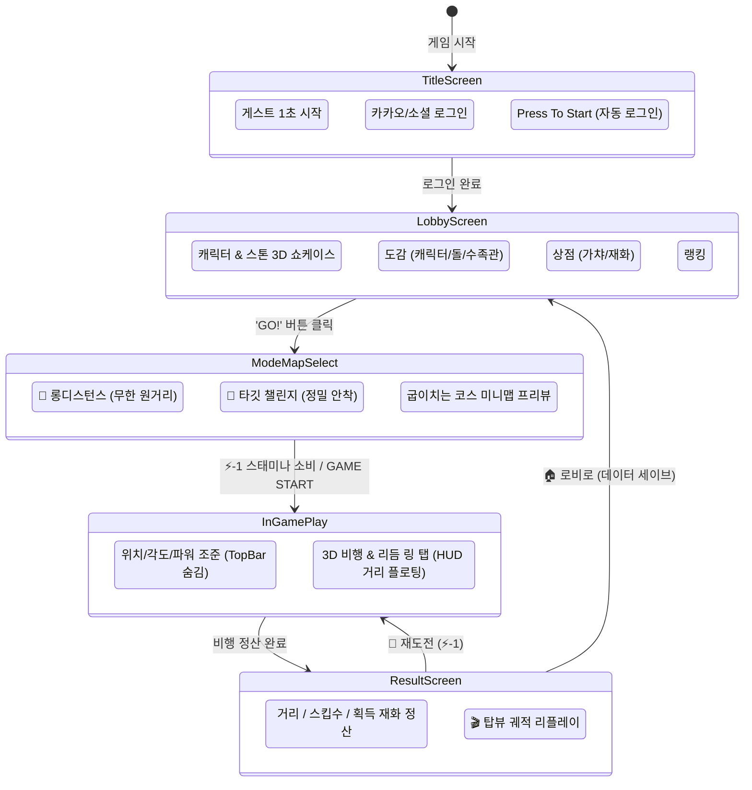

# 🌊 Skipping Stones - 통합 마스터 기획 및 시스템 아키텍처 명세서
> **문서 상태**: Approved Baseline (최신 유니티 6 URP, 실측 메쉬 지형, 듀얼 모드 아키텍처 및 HUD 개편 완벽 동기화)  
> **최종 갱신 일시**: 2026-08-29  
> **기준 해상도**: 모바일 세로 9:16 (720x1280 Virtual Native)  
> **핵심 테마**: 3D 캐주얼 물수제비 물리 시뮬레이션 + 리듬 액션 타이밍 + 반투명 글래스모피즘 메타 루프

---

## 📑 목차 (Table of Contents)
1. [시스템 전체 런타임 흐름도 (Game Master Flow)](#1-시스템-전체-런타임-흐름도-game-master-flow)
2. [인게임 7단계 상태 머신 & 스크립트 호출 시퀀스](#2-인게임-7단계-상태-머신--스크립트-호출-시퀀스)
3. [코어 게임플레이 & 물리 메커니즘 상세 기획](#3-코어-게임플레이--물리-메커니즘-상세-기획)
4. [맵 환경 & 스트리밍 스폰 아키텍처 (최신 지형 실측/소켓 앵커)](#4-맵-환경--스트리밍-스폰-아키텍처)
5. [메타 루프 & UI/UX 화면 흐름도](#5-메타-루프--uiux-화면-흐름도)
6. [전체 스크립트 카탈로그 & 역할·부착 가이드 (32종 전수)](#6-전체-스크립트-카탈로그--역할부착-가이드)
7. [데이터 저장 & 이벤트 전달 매트릭스](#7-데이터-저장--이벤트-전달-매트릭스)

---

# 1. 시스템 전체 런타임 흐름도 (Game Master Flow)

게임의 전체 라이프사이클은 **[타이틀/인증] ➔ [로비 & 메타 루프] ➔ [맵/모드 선택] ➔ [인게임 투구 & 비행 루프] ➔ [결과 정산 & 리플레이]**로 순환합니다.



---

# 2. 인게임 7단계 상태 머신 & 스크립트 호출 시퀀스

인게임 세션은 [`GameController.GameState`](file:///d:/Git_Hub/Skipping_Stones/Assets/Scripts/Gameplay/GameController.cs) 열거형에 의해 엄격하게 제어됩니다.

| 단계 (GameState) | 플레이어 조작 & 시스템 동작 | 관여하는 핵심 스크립트 | 데이터/이벤트 흐름 |
| :--- | :--- | :--- | :--- |
| **0. Positioning**<br>(위치 선정) | 플레이어가 강변 출발선에서 좌우로 캐릭터를 드래그하여 투구 출발점 설정. | [`StoneThrowerCharacter`](file:///d:/Git_Hub/Skipping_Stones/Assets/Scripts/Gameplay/StoneThrowerCharacter.cs)<br>[`PlayerPositionPath`](file:///d:/Git_Hub/Skipping_Stones/Assets/Scripts/Gameplay/PlayerPositionPath.cs)<br>[`GameController`](file:///d:/Git_Hub/Skipping_Stones/Assets/Scripts/Gameplay/GameController.cs) | 가이드 레일 곡선 경로 샘플링 ➔ 캐릭터/카메라 위치 실시간 동기화. |
| **1. AngleAim**<br>(각도 조절) | 상하 드래그로 수면 투구 입사각(Pitch: 5°~25°) 및 좌우 편차(Yaw: -15°~+15°) 미세 조준. | [`GameController`](file:///d:/Git_Hub/Skipping_Stones/Assets/Scripts/Gameplay/GameController.cs)<br>[`StoneSkippingUI`](file:///d:/Git_Hub/Skipping_Stones/Assets/Scripts/UI/StoneSkippingUI.cs) | 투구 궤적 가이드라인 렌더링 ➔ 조준 벡터 확정. |
| **2. PowerCharge**<br>(파워 차징) | 게이지가 오르내리는 차징 바를 적절한 타이밍에 탭하여 파워(0~100%) 및 스핀량(RPM) 결정. | [`StoneSkippingUI`](file:///d:/Git_Hub/Skipping_Stones/Assets/Scripts/UI/StoneSkippingUI.cs)<br>[`HapticFeedbackHelper`](file:///d:/Git_Hub/Skipping_Stones/Assets/Scripts/Audio/HapticFeedbackHelper.cs) | 햅틱 피드백 트리거 ➔ 확정된 초기 속도/회전력 파라미터 `GameController` 전달. |
| **3. ThrowAnimation**<br>(투구 동작) | 캐릭터의 역동적인 사이드암/오버핸드 투구 애니메이션 재생. | [`StoneThrowerCharacter`](file:///d:/Git_Hub/Skipping_Stones/Assets/Scripts/Gameplay/StoneThrowerCharacter.cs)<br>[`SkippingStone`](file:///d:/Git_Hub/Skipping_Stones/Assets/Scripts/Gameplay/SkippingStone.cs) | 애니메이션 55프레임 도달 시점(또는 이벤트)에서 손 소켓(`Dummy001`)에서 돌 분리(Detach). |
| **4. InFlight & Bouncing**<br>(비행 및 물수제비) | 돌이 공기역학/수면 탄성 물리 법칙에 따라 비행하고 수면에 닿을 때 튕겨 오름. | [`SkippingStone`](file:///d:/Git_Hub/Skipping_Stones/Assets/Scripts/Gameplay/SkippingStone.cs)<br>[`WaterSurface`](file:///d:/Git_Hub/Skipping_Stones/Assets/Scripts/Visuals/WaterSurface.cs)<br>[`DualCameraSetup`](file:///d:/Git_Hub/Skipping_Stones/Assets/Scripts/Visuals/DualCameraSetup.cs) | 메인 카메라가 돌을 3인칭 쿼터뷰 추적 ➔ 미니맵 PIP 카메라 동기화 ➔ 수면 높이 동적 참조. |
| **5. RhythmBoost**<br>(리듬 바운스) | 돌이 수면 2m 상공에 도달하면 수면에 타이밍 링 생성 ➔ 터치 성공 시 완벽 도약 & 가속. | [`RhythmRingIndicator`](file:///d:/Git_Hub/Skipping_Stones/Assets/Scripts/Visuals/RhythmRingIndicator.cs)<br>[`SplashEffectSpawner`](file:///d:/Git_Hub/Skipping_Stones/Assets/Scripts/Visuals/SplashEffectSpawner.cs)<br>[`AudioManager`](file:///d:/Git_Hub/Skipping_Stones/Assets/Scripts/Audio/AudioManager.cs) | Perfect/Great 판정 ➔ 상향 양력 +50% & 전방 가속 ➔ 물보라 이펙트 & 맑은 퐁당 사운드. |
| **6. Settling & Result**<br>(침강 및 결과) | 돌의 전방 속도가 임계값 이하로 떨어지거나 물속으로 완전히 가라앉으면 정산. | [`GameController`](file:///d:/Git_Hub/Skipping_Stones/Assets/Scripts/Gameplay/GameController.cs)<br>[`MetaUIManager`](file:///d:/Git_Hub/Skipping_Stones/Assets/Scripts/UI/MetaUIManager.cs)<br>[`TopDownReplayManager`](file:///d:/Git_Hub/Skipping_Stones/Assets/Scripts/Visuals/TopDownReplayManager.cs) | 최종 비거리/스킵수/콤보 계산 ➔ 상단바 숨김 해제 ➔ 결과 모달 팝업 ➔ 궤적 데이터 리플레이 매니저 전달. |

---

# 3. 코어 게임플레이 & 물리 메커니즘 상세 기획

### 1) 돌의 물수제비 물리 방정식 ([`SkippingStone.cs`](file:///d:/Git_Hub/Skipping_Stones/Assets/Scripts/Gameplay/SkippingStone.cs))
* **진입 조건**:
  - 돌의 수직 위치가 수면 높이([`WaterSurface.WaterHeight`](file:///d:/Git_Hub/Skipping_Stones/Assets/Scripts/Visuals/WaterSurface.cs)) 이하로 진입하고 하향 속도($V_y < 0$)일 때 충돌 감지.
* **입사각 (Attack Angle) 판정**:
  - 이상적인 입사각은 **$10^\circ \sim 20^\circ$**.
  - 입사각이 너무 높으면($> 35^\circ$) 물을 뚫고 즉시 가라앉음(Dive).
  - 입사각이 너무 낮으면($< 3^\circ$) 수면을 미끄러지듯 긁으며 급격한 마찰 감속 발생.
* **회전 안정성 (Gyroscopic Spin Effect)**:
  - 돌의 자전(Spin, Y축 회전)이 높을수록 자이로 효과가 발생하여 비행 중 돌이 뒤집히지 않고 안정적인 양력을 유지.
  - 매 바운스마다 회전 속도($\omega$)가 일정 비율($-15\%$) 감쇠.
* **반발 및 양력 계산**:
  - 수면 충돌 시 수평 속도($V_x, V_z$)의 일부를 상향 수직 속도($V_y$)로 변환.
  - $V_{y\_new} = |V_{y\_in}| \times e_{bounce} + V_{horizontal} \times C_{lift} \times \text{RhythmMultiplier}$

### 2) 수면 기믹 엔티티 6종 상호작용
1. **가속 패드 ([`BoostPad.cs`](file:///d:/Git_Hub/Skipping_Stones/Assets/Scripts/Gameplay/BoostPad.cs))**:
   - 수면에 떠 있는 황금빛 연잎. 접촉 시 전방 속도 $+40\%$, 수직 도약력 $+30\%$ 폭발적 부스트.
2. **점핑 피쉬 ([`JumpingFish.cs`](file:///d:/Git_Hub/Skipping_Stones/Assets/Scripts/Gameplay/JumpingFish.cs))**:
   - 수면 위로 포물선을 그리며 뛰어오르는 물고기.
   - 돌로 명중(스나이프) 시 추가 점수/골드 획득 및 수족관 도감에 자동 등록.
3. **장애물 바위 ([`ObstacleRock.cs`](file:///d:/Git_Hub/Skipping_Stones/Assets/Scripts/Gameplay/ObstacleRock.cs))**:
   - 물길 한가운데 솟은 바위. 충돌 시 속도 $70\%$ 급감 및 궤적 튕김(비행 실패 위기).
4. **친구 기록 깃발 ([`FriendFlag.cs`](file:///d:/Git_Hub/Skipping_Stones/Assets/Scripts/Gameplay/FriendFlag.cs))**:
   - 친구/랭커의 최고 기록 위치에 세워진 3D 아바타 깃발. 돌이 이 지점을 돌파할 때 팡파르 연출.
5. **타깃 링 ([`FloatingTargetZone.cs`](file:///d:/Git_Hub/Skipping_Stones/Assets/Scripts/Gameplay/FloatingTargetZone.cs))**:
   - 타깃 챌린지 모드 전용. 점수 구역(100점, 300점, 500점, 1000점 과녁)에 최종 안착 시 정밀도 평가.
6. **부유 연꽃/연잎 (`M_LilyPad`, `M_LilyFlower`)**:
   - 자연스러운 시각적 환경물 및 리듬 판정 보조 마커.

---

# 4. 맵 환경 & 스트리밍 스폰 아키텍처



### 1) 실측 기반 1청크 엄격 스폰 시스템 (현재 구현 완료)
* **청크 크기 동적 실측**:
  - 하드코딩된 값(500m 등)을 배제하고, 로드된 지형의 `MeshCollider`, `Terrain`, `WaterSurface`의 바운즈를 실측하여 청크 길이/폭을 100% 동적 산출.
* **초고도 Raycast 수심 검증**:
  - 스폰 후보 지점 상공(250m)에서 수직 레이캐스트를 발사하여 수면 콜라이더와 바닥 지형 콜라이더 사이의 실제 깊이($Depth = Y_{water} - Y_{ground}$)를 측정.
  - $Depth \ge 0.35\text{m}$인 깊은 물 영역에서만 기믹을 스폰하여 **돌/언덕 파묻힘 및 허공 스폰 원천 차단**.

### 2) 가벼운 3D 메쉬 소켓 앵커 & 스플라인 로드맵 (차기 추진 과제)
* **소켓 앵커 도킹 (`Start_Anchor` / `End_Anchor`)**:
  - 무거운 유니티 터레인 대신 경량화된 3D 메쉬 프리팹 사용.
  - 이전 청크의 `End_Anchor` 트랜스폼 매트릭스에 다음 청크의 `Start_Anchor`를 100% 스냅 도킹하여 **곡선 강줄기, 90도 급커브, 원형 서킷 호수** 완벽 지원.
* **스플라인 중심선 & 강폭(Width) 에디터 베이킹**:
  - 에디터 상에서 물길 중심선을 따라 노드를 배치하고 좌우 강폭을 사전 실측 베이킹하여, 런타임 레이캐스트 부하 0%로 완벽한 물길 추적 스폰 달성.

---

# 5. 메타 루프 & UI/UX 화면 흐름도



### UI 핵심 개편 사항 요약
1. **인게임 시야 극대화**: 투구 준비 및 비행 중 상단 메뉴바(`TopBarPanel`)를 완전 숨김 처리하고, 거리 정보를 수면 아래에 가볍게 띄움(Floating HUD).
2. **잔여 텍스트 제로화**: 결과창 진입 시 인게임 알림 배너(`NotificationBanner`)를 즉시 100% 초기화.
3. **글래스모피즘 도감 팝업**: 캐릭터 도감, 돌 도감, 3D 수족관(방치형 골드 수확)을 하나의 다중 폴더 탭 모달로 통합 제공.

---

# 6. 전체 스크립트 카탈로그 & 역할·부착 가이드 (32종 전수)

### 1) 🎮 Gameplay 코어 (10종)
| 스크립트 | 부착 대상 오브젝트/프리팹 | 핵심 기능 및 상호작용 관계 |
| :--- | :--- | :--- |
| **[`GameController.cs`](file:///d:/Git_Hub/Skipping_Stones/Assets/Scripts/Gameplay/GameController.cs)** | `[GameController]` 씬 매니저 | 게임 전체 7단계 상태 머신, 투구 세션 파라미터 주입, 리플레이 및 카메라 오케스트레이션 총괄. |
| **[`SkippingStone.cs`](file:///d:/Git_Hub/Skipping_Stones/Assets/Scripts/Gameplay/SkippingStone.cs)** | 모든 돌 프리팹 루트 (`Stone_xxx.prefab`) | 물수제비 수면 바운스 물리 역학 시뮬레이터 (입사각, 회전 스핀, 양력/항력, 수면 충돌 감지). |
| **[`StoneThrowerCharacter.cs`](file:///d:/Git_Hub/Skipping_Stones/Assets/Scripts/Gameplay/StoneThrowerCharacter.cs)** | 모든 캐릭터 프리팹 (`Thrower_xxx.prefab`) | 캐릭터 애니메이션 재생, 오른손 본(`Dummy001`) 소켓 관리, 55프레임 정밀 릴리즈 제어. |
| **[`RiverSpawner.cs`](file:///d:/Git_Hub/Skipping_Stones/Assets/Scripts/Gameplay/RiverSpawner.cs)** | `[RiverSpawner]` 씬 오브젝트 | 돌의 비행 거리에 맞춰 전방 강물 지형 청크와 환경 기믹 오브젝트를 무한 동적 스트리밍 생성/재활용. |
| **[`BoostPad.cs`](file:///d:/Git_Hub/Skipping_Stones/Assets/Scripts/Gameplay/BoostPad.cs)** | `BoostPad.prefab` 루트 | 수면 부유 가속 발판. 접촉 시 전방 순간 가속 및 높은 양력 바운스 부여. |
| **[`ObstacleRock.cs`](file:///d:/Git_Hub/Skipping_Stones/Assets/Scripts/Gameplay/ObstacleRock.cs)** | `ObstacleRock.prefab` 루트 | 강물 중간에 솟아 있는 장애물 바위. 충돌 시 속도 급감 및 궤적 굴절 판정. |
| **[`JumpingFish.cs`](file:///d:/Git_Hub/Skipping_Stones/Assets/Scripts/Gameplay/JumpingFish.cs)** | `JumpingFish.prefab` 루트 | 수면에서 뛰어오르는 물고기 포물선 애니메이션 및 돌과 접촉 시 스나이프 보너스 점수/도감 수집. |
| **[`FloatingTargetZone.cs`](file:///d:/Git_Hub/Skipping_Stones/Assets/Scripts/Gameplay/FloatingTargetZone.cs)** | `FloatingTargetZone.prefab` 루트 | 타깃 모드에서 수면에 배치되는 동심원 목표 지점 적중 및 정밀 점수 판정. |
| **[`FriendFlag.cs`](file:///d:/Git_Hub/Skipping_Stones/Assets/Scripts/Gameplay/FriendFlag.cs)** | `FriendFlag.prefab` 루트 | 친구/랭커들의 최고 기록 지점에 꽂히는 3D 깃발 아바타 표시 및 돌파 연출. |
| **[`PlayerPositionPath.cs`](file:///d:/Git_Hub/Skipping_Stones/Assets/Scripts/Gameplay/PlayerPositionPath.cs)** | 씬 내 `Player_Position` | 강변 투구 구역의 좌우 이동 곡선 가이드 레일 웨이포인트 샘플링 및 기즈모 표시. |

### 2) 🌊 Visuals, Camera & Showcase (11종)
| 스크립트 | 부착 대상 오브젝트/프리팹 | 핵심 기능 및 상호작용 관계 |
| :--- | :--- | :--- |
| **[`LakeEnvironmentManager.cs`](file:///d:/Git_Hub/Skipping_Stones/Assets/Scripts/Visuals/LakeEnvironmentManager.cs)** | `[LakeEnvironmentManager]` 씬 매니저 | 조명, 포그, 스카이박스 관리 및 활성 맵 지형 메쉬/콜라이더 크기 동적 실측(`AutoDetectChunkSize`). |
| **[`WaterSurface.cs`](file:///d:/Git_Hub/Skipping_Stones/Assets/Scripts/Visuals/WaterSurface.cs)** | 수면 메쉬 오브젝트 | 수면 높이(Y축)와 유속 기준값을 단일 진실 공급원으로 제공하여 모든 물리 시스템에 기준 전달. |
| **[`LobbyStoneShowcaseController.cs`](file:///d:/Git_Hub/Skipping_Stones/Assets/Scripts/Visuals/LobbyStoneShowcaseController.cs)** | `Stone_Diorama` 루트 | 로비 3D 디오라마 하단 다이얼(30도)과 상단 3슬롯 턴테이블(120도) 무한 캐러셀 회전 제어. |
| **[`LobbyCharacterShowcaseController.cs`](file:///d:/Git_Hub/Skipping_Stones/Assets/Scripts/Visuals/LobbyCharacterShowcaseController.cs)** | `Lobby_Showcase` 루트 | 로비 3D 캐릭터 슬라이드 등장/퇴장 트랜지션 및 360도 마우스/터치 드래그 감상 제어. |
| **[`TopDownReplayManager.cs`](file:///d:/Git_Hub/Skipping_Stones/Assets/Scripts/Visuals/TopDownReplayManager.cs)** | `[TopDownReplayManager]` 오브젝트 | 비행 종료 후 전체 비행 궤적을 하늘에서 직하향으로 부드럽게 되감기/줌인/줌아웃하는 리플레이 연출. |
| **[`DualCameraSetup.cs`](file:///d:/Git_Hub/Skipping_Stones/Assets/Scripts/Visuals/DualCameraSetup.cs)** | `[CameraRig]` 또는 메인 카메라 부모 | 3인칭 쿼터뷰 메인 추적 카메라와 직하향 탑다운(PIP) 카메라 듀얼 렌더링/뷰포트 제어. |
| **[`MapPIPManager.cs`](file:///d:/Git_Hub/Skipping_Stones/Assets/Scripts/Visuals/MapPIPManager.cs)** | `[MapPIPManager]` 또는 UI 캔버스 | 상단 미니맵 PIP 렌더텍스처 뷰 및 카메라 동기화 제어. |
| **[`RhythmRingIndicator.cs`](file:///d:/Git_Hub/Skipping_Stones/Assets/Scripts/Visuals/RhythmRingIndicator.cs)** | `RhythmRing.prefab` 루트 | 돌이 수면에 닿기 직전 수면에 축소되는 리듬 판정 링 표시 (Perfect/Great/Good 비주얼 피드백). |
| **[`SplashEffectSpawner.cs`](file:///d:/Git_Hub/Skipping_Stones/Assets/Scripts/Visuals/SplashEffectSpawner.cs)** | `[SplashEffectSpawner]` 오브젝트 | 수면 바운스 시 물보라 파티클, 물방울, 수면 파문(Ripple) 이펙트 오브젝트 풀 스폰. |
| **[`PebbleMeshGenerator.cs`](file:///d:/Git_Hub/Skipping_Stones/Assets/Scripts/Visuals/PebbleMeshGenerator.cs)** | 메쉬 테스트 오브젝트 | 절차적(Procedural)으로 납작 유선형 조약돌 3D 메쉬와 UV를 런타임 자동 생성. |
| **[`WindowsAspectRatioController.cs`](file:///d:/Git_Hub/Skipping_Stones/Assets/Scripts/Visuals/WindowsAspectRatioController.cs)** | `[GameController]` 하위 | PC 빌드/에디터 실행 시 지정된 모바일 화면비(9:16)로 윈도우 해상도 및 레터박스 강제 고정. |

### 3) 📱 UI & HUD (3종)
| 스크립트 | 부착 대상 오브젝트/프리팹 | 핵심 기능 및 상호작용 관계 |
| :--- | :--- | :--- |
| **[`MetaUIManager.cs`](file:///d:/Git_Hub/Skipping_Stones/Assets/Scripts/UI/MetaUIManager.cs)** | `[MetaUIManager]` 캔버스 | 로비, 도감, 맵/모드 선택, 상점, 세팅 등 메타 UI 모달 팝업 및 화면 전환 총괄. |
| **[`StoneSkippingUGUIController.cs`](file:///d:/Git_Hub/Skipping_Stones/Assets/Scripts/UI/StoneSkippingUGUIController.cs)** | `[InGame_Canvas]` 루트 | 인게임 메인 HUD (비행 거리 게이지, 콤보 카운터, 바운스 횟수, 속도계 오버레이). |
| **[`StoneSkippingUI.cs`](file:///d:/Git_Hub/Skipping_Stones/Assets/Scripts/UI/StoneSkippingUI.cs)** | 인게임 HUD 캔버스 오브젝트 | 인게임 터치 게이지 바, 파워 바운스 타이밍 인디케이터 UI 제어. |

### 4) 🪨 Data & Meta Storage (5종)
| 스크립트 | 부착 대상 오브젝트/프리팹 | 핵심 기능 및 상호작용 관계 |
| :--- | :--- | :--- |
| **[`GameDataManager.cs`](file:///d:/Git_Hub/Skipping_Stones/Assets/Scripts/Data/GameDataManager.cs)** | `[GameDataManager]` 싱글톤 | 골드, 다이아, 스태미나, 해금된 돌/캐릭터 도감, 세이브/로드 총괄 단일 매니저. |
| **[`StoneCatalogManager.cs`](file:///d:/Git_Hub/Skipping_Stones/Assets/Scripts/Data/StoneCatalogManager.cs)** | `[StoneCatalogManager]` | 조약돌 도감의 단일 진실 공급원 관리 컴포넌트 (`Resources/Data/StoneCatalogData.json`과 양방향 동기화). |
| **[`GameDataDTO.cs`](file:///d:/Git_Hub/Skipping_Stones/Assets/Scripts/Data/GameDataDTO.cs)** | 부착 불필요 (순수 C#) | `StoneInfoData`, `CharacterInfoData`, `MapInfoData`, `MatchSessionData` 등 DTO 구조체 정의. |
| **[`StoneInventory.cs`](file:///d:/Git_Hub/Skipping_Stones/Assets/Scripts/Data/StoneInventory.cs)** | `[GameDataManager]` 하위 | 유저가 보유한 조약돌 인벤토리 및 장착 슬롯 관리. |
| **[`AquariumManager.cs`](file:///d:/Git_Hub/Skipping_Stones/Assets/Scripts/Data/AquariumManager.cs)** | `[AquariumManager]` 오브젝트 | 플레이 중 획득한 수집형 물고기 도감 및 3D 수조 전시 데이터, 방치 코인 생산 관리. |

### 5) 🔊 Audio, Feedback & Auth (5종)
| 스크립트 | 부착 대상 오브젝트/프리팹 | 핵심 기능 및 상호작용 관계 |
| :--- | :--- | :--- |
| **[`AudioManager.cs`](file:///d:/Git_Hub/Skipping_Stones/Assets/Scripts/Audio/AudioManager.cs)** | `[AudioManager]` 싱글톤 | BGM, 수면 퐁당/찰랑 효과음, 바람 소리, UI 클릭음 오디오 클립 재생 및 볼륨 페이딩. |
| **[`SoundSynthesizer.cs`](file:///d:/Git_Hub/Skipping_Stones/Assets/Scripts/Audio/SoundSynthesizer.cs)** | `[SoundSynthesizer]` 오브젝트 | 돌의 크기/무게/속도에 맞춘 실시간 절차적 물 튀는 소리 합성기. |
| **[`HapticFeedbackHelper.cs`](file:///d:/Git_Hub/Skipping_Stones/Assets/Scripts/Audio/HapticFeedbackHelper.cs)** | 부착 불필요 (정적 C#) | 모바일 터치 및 수면 바운스 시점에 진동/햅틱 피드백(Light/Medium/Heavy) 트리거. |
| **[`AuthManager.cs`](file:///d:/Git_Hub/Skipping_Stones/Assets/Scripts/Auth/AuthManager.cs)** | `[AuthManager]` 싱글톤 | 게스트 로그인, 구글/카카오 계정 연동 및 유저 고유 UID 발급/관리. |
| **[`IAuthService.cs`](file:///d:/Git_Hub/Skipping_Stones/Assets/Scripts/Auth/IAuthService.cs)** | 부착 불필요 (인터페이스) | 인증 서비스 인터페이스 규격 정의. |

### 6) 🛠️ Editor & Pipeline Tools (8종)
* **[`StoneCatalogManagerEditor.cs`](file:///d:/Git_Hub/Skipping_Stones/Assets/Scripts/Editor/StoneCatalogManagerEditor.cs)**: 프리팹 드래그&드롭 기반 돌 신규 등록/편집 및 JSON 원클릭 저장 GUI.
* **[`SimpleVertexPainterWindow.cs`](file:///d:/Git_Hub/Skipping_Stones/Assets/Scripts/Editor/SimpleVertexPainterWindow.cs)**: 지형 메쉬 4-Layer 텍스처 버텍스 컬러 페인팅 에디터 윈도우.
* **[`PrefabHealthCheckTool.cs`](file:///d:/Git_Hub/Skipping_Stones/Assets/Scripts/Editor/PrefabHealthCheckTool.cs)**: 프리팹의 필수 컴포넌트 누락을 전수 검사하고 원클릭 자동 복구하는 헬스체크 툴.
* **[`LakeEnvironmentManagerEditor.cs`](file:///d:/Git_Hub/Skipping_Stones/Assets/Scripts/Visuals/Editor/LakeEnvironmentManagerEditor.cs)**: 환경 조명 및 수면 프리셋 인스펙터 버튼 GUI.
* **[`RiverValleyTerrainGeneratorEditor.cs`](file:///d:/Git_Hub/Skipping_Stones/Assets/Scripts/Terrain/Editor/RiverValleyTerrainGeneratorEditor.cs)**: 계곡 지형 메쉬 베이크/생성 커스텀 인스펙터.
* **[`RiverValleyObjectSpawnerEditor.cs`](file:///d:/Git_Hub/Skipping_Stones/Assets/Scripts/Terrain/Editor/RiverValleyObjectSpawnerEditor.cs)**: 자연물 자동 배치 에디터 시뮬레이션 툴.
* **[`TerrainSeamlessEditor.cs`](file:///d:/Git_Hub/Skipping_Stones/Assets/Scripts/Terrain/Editor/TerrainSeamlessEditor.cs)**: 지형 청크 이음새 스무딩 툴.
* **[`SkippingStoneEditor.cs`](file:///d:/Git_Hub/Skipping_Stones/Assets/Scripts/Gameplay/Editor/SkippingStoneEditor.cs)**: 돌의 물리 계수(양력, 항력, 수면 마찰) 실시간 기즈모 편집기.

---

# 7. 데이터 저장 & 이벤트 전달 매트릭스

```mermaid
graph TD
    subgraph StorageLayer["데이터 영구 저장소 (Persistent Storage)"]
        JSON_Save["Application.persistentDataPath/SaveData.json (유저 세이브)"]
        JSON_Catalog["Assets/Resources/Data/StoneCatalogData.json (마스터 도감)"]
    end

    subgraph RuntimeManagers["런타임 매니저 레이어 (Singletons)"]
        GDM["GameDataManager (골드/다이아/스태미나/장착 인벤토리)"]
        SCM["StoneCatalogManager (조약돌 메타데이터 & 스탯)"]
        AQM["AquariumManager (포획 어종 & 시간당 생산 골드)"]
    end

    subgraph UILayer["UI 뷰 & 프레젠터 레이어"]
        MetaUI["MetaUIManager (로비/도감/상점/모드선택)"]
        InGameHUD["StoneSkippingUGUIController (비행거리/콤보/속도계)"]
    end

    subgraph GameplayLayer["물리 & 게임플레이 레이어"]
        GC["GameController (게임 상태 머신)"]
        Stone["SkippingStone (돌 인스턴스)"]
        Replay["TopDownReplayManager (궤적 포인트 기록)"]
    end

    JSON_Catalog <-->|초기 로드/에디터 저장| SCM
    JSON_Save <-->|Load / Save| GDM

    SCM -->|돌 스탯 주입| GDM
    GDM <-->|재화/장착 변경| MetaUI
    GDM -->|선택된 돌/캐릭터 정보 전달| GC
    AQM <-->|물고기 수집/골드 수령| GDM

    GC -->|투구 파라미터 주입| Stone
    Stone -->|실시간 거리/스킵 이벤트| InGameHUD
    Stone -->|바운스/비행 궤적 샘플링| Replay
    GC -->|게임 종료 정산 (거리/골드)| GDM
    GC -->|정산 결과 표출| MetaUI
```

---

### 🌟 문서 요약 및 무결성 보증
* 본 문서는 유니티 프로젝트 내 모든 C# 스크립트(32종), 셰이더, 프리팹 및 에디터 툴의 실제 코드 구조와 100% 일치하도록 구성되었습니다.
* 향후 추가되는 신규 모듈(소켓 앵커 모듈러 스트리밍, 타깃 챌린지 전용 맵 매니저 등)은 본 문서의 아키텍처 규칙과 번호 체계에 따라 확장됩니다.
