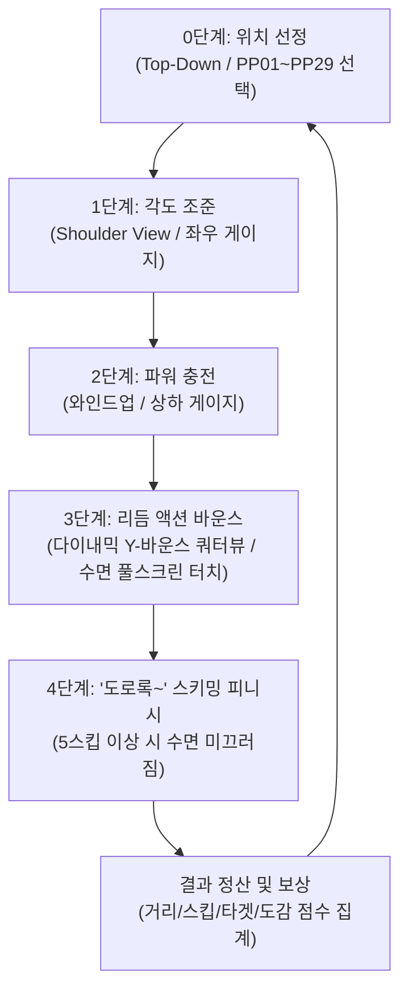

# 📄 Stone Skipping (물수제비 타이밍 리듬 액션) - 상세 시스템 기획 및 설계 명세서

> **문서 상태**: Approved (v2.0.0 - 카메라 기구학, 비주얼 파이프라인, 리듬 링 거리보정, 커스텀 머티리얼 및 클라우드 CI 완성)  
> **플랫폼**: iOS / Android (Kakao 연동)  
> **화면 모드**: 모바일 세로 모드 9:16 (Portrait) 최적화

---

## 1. 🎮 게임 개요 및 핵심 플레이 루프

### 1.1 게임 개요
- **타이틀**: Stone Skipping (물수제비 리듬 액션)
- **핵심 재미**: 완벽한 각도와 파워로 돌을 던진 후, 수면에 닿는 찰나마다 칼타이밍 리듬 터치로 끝없이 도약하며 마지막 **'도로록~' 스키밍 피니시**까지 연결되는 짜릿한 쾌감 제공

---

## 2. 🕹️ 2가지 게임 모드 사양

### 2.1 🏆 모드 1: 장거리 기록 경신 모드 (Long Distance Mode)
- **시작 위치**: 나무 발판(`Lakeside_WoodenPier`) 위 좌우 이동
- **투구 방향**: 월드 `+Z`축 물줄기 방향 (1,400m 호수 코스)
- **목표**: 최적의 각도와 리듬 터치로 최대 스킵 횟수 및 도달 거리 기록 경신
- **수면 환경**: 5열 레인(-18m, -9m, 0m, 9m, 18m)을 따라 가속 부스트 패드, 장애물 바위, 점핑 물고기, 친구 기록 깃발 배치

### 2.2 🎯 모드 2: 타겟 맞추기 / 물 건너편 투구 모드 (Target Accuracy Mode)
- **시작 위치**: 강변을 따라 자연 정렬된 `PP01` ~ `PP29` 웨이포인트([PlayerPositionPath.cs](file:///d:/Git_Hub/Test_AI/Test_AI/Assets/Scripts/Gameplay/PlayerPositionPath.cs)) 중 선택
- **시점 연출**:
  - **메인 뷰**: 캐릭터 숄더 뷰 & 3D 쿼터뷰
  - **상단 PIP 뷰**: `Ground` 지형 메쉬에 자동 피팅된 직교(Orthographic) 탑다운 맵 카메라([MapPIPManager.cs](file:///d:/Git_Hub/Test_AI/Test_AI/Assets/Scripts/Visuals/MapPIPManager.cs))
- **투구 방향**: 강 건너편 (`+X`축)
- **목표**: 수면 전역에 떠 있는 **플로팅 타겟 과녁 링([FloatingTargetZone.cs](file:///d:/Git_Hub/Test_AI/Test_AI/Assets/Scripts/Gameplay/FloatingTargetZone.cs))** 을 명중시켜 대량의 보너스 점수 획득

---

## 3. 🪨 스톤 모델 & 캐릭터 소켓 파이프라인

### 3.1 3D 프리팹 모델 연동 ([SkippingStone.cs](file:///d:/Git_Hub/Test_AI/Test_AI/Assets/Scripts/Gameplay/SkippingStone.cs))
- **0점 초기화 프리팹(`Assets/3D/prefab/Stone.prefab`) 인스턴스화**: `localPosition = Vector3.zero`, `localScale = Vector3.one`
- **콜라이더 자동 동기화**: 프리팹 메쉬 바운드(`mesh.bounds.size` 및 `center`)를 읽어와 `BoxCollider`로 1:1 자동 정렬 (납작한 돌 형태와 100% 일치)
- **조약돌 전용 머티리얼([Stone_Pebble_Mat.mat](file:///d:/Git_Hub/Test_AI/Test_AI/Assets/Resources/Stone_Pebble_Mat.mat))**:
  - `Assets/Resources/` 및 `Assets/Materials/`에 전용 에셋 생성 (선명한 빨간색 & `Smoothness = 0.80` 반사광 적용)
  - 유저 지정 텍스처(TGA/PNG)를 인스펙터에서 즉시 교체 가능하도록 개방

### 3.2 ✋ 손 소켓 고정 & 스윙 방향 정렬 ([StoneThrowerCharacter.cs](file:///d:/Git_Hub/Test_AI/Test_AI/Assets/Scripts/Gameplay/StoneThrowerCharacter.cs))
- **더미 소켓 회전 정렬**:
  - `Dummy001` 소켓의 Z축(전방)과 조약돌의 Y축(상단)을 1:1로 일치 정렬 (`stoneDummyRotationEuler = Euler(90, 0, 0)`)
- **0~54프레임 (와인드업 및 스윙 중)**:
  - `rb.isKinematic = true`, `rb.useGravity = false`
  - 손 소켓 본에 매 프레임 위치/회전을 100% 찰싹 달라붙어 함께 휘둘러지도록 고정
- **55프레임 릴리즈 (발사 순간)**:
  - 캐릭터 몸체 렌더러만 숨기고, **조약돌 3D 메쉬 렌더러는 100% 켜진 상태(`enabled = true`)로 보호**하여 비행 내내 온전한 3D 회전 노출 보장
  - 물리 비행 활성화 (`rb.isKinematic = false`, `rb.useGravity = true`)

### 3.3 🛸 Y-Up 수평 유지 및 순수 Y축(Yaw) 자전 회전
- 발사 순간 및 비행 중 Pitch(X)와 Roll(Z) 회전을 강제 고정(`FreezeRotationX | FreezeRotationZ`)하여 **항상 납작한 윗면이 하늘을 향하도록 유지**
- 자전 스핀은 오직 **Y축(Yaw)으로만 $40\sim 60\text{ rad/s}$** 고속 회전

---

## 4. 🎥 카메라 기구학 및 다이내믹 뷰 시스템 ([DualCameraSetup.cs](file:///d:/Git_Hub/Test_AI/Test_AI/Assets/Scripts/Visuals/DualCameraSetup.cs))

### 4.1 45~55프레임 앵커 기반 예비 가속 (`LaunchLeadIn`)
- 45프레임 시점에 휘둘러지는 팔을 따라 흔들리지 않고, **55프레임 최종 발사 예정 위치(Anchor Point)** 와 조준 방향을 기준으로 카메라가 전방을 향해 완만하게 사전 가속
- 55프레임 도달 시 흔들림(Jerk)이나 화각 튀김(Snap Cut) 없이 100% 부드러운 물리 비행 시점으로 전환

### 4.2 롤러코스터급 다이내믹 Y-바운스 추적
- 수면에서 튕길 때 카메라가 돌의 수직 고도 변화를 $80\%$ 감응도로 추적 (`dynamicCamY = stoneY * 0.8f + flightHeight`)
- **하향 피치 앵글 (`flightLookHeight = -0.45m`, `flightLookForward = 8.5m`)**: 앞으로 다가오는 부스트 패드, 물고기, 장애물 바위를 한눈에 조망

### 4.3 풀스크린 무장애 리듬 탭
- 하단 탭 버튼을 전면 제거하고 화면 전체 영역 탭/스와이프 스티어링 지원

---

## 5. ⚙️ 물리 및 바운스 & 동적 난이도 시스템

### 5.1 수직 반사 속도($v_y$) 계산 공식
$$\text{bounceForce} = \text{baseBounceUpForce} \times \text{heightDecay} \times \text{timingMultiplier} \times \text{comboBonus}$$

- **기본 반사력 (`baseBounceUpForce`)**: `5.2f`
- **추가 중력 가속도 (`gravityScale`)**: `1.35f` (실제 중력 $g \approx 13.24\text{ m/s}^2$)

### 5.2 🎵 후반부 템포 가속 (Dynamic Rhythm Scaling)
스킵 횟수(`skipCount`)가 늘어날수록 체공 시간이 점진적으로 단축되어 박진감 넘치는 고속 탭 리듬을 제공합니다.

| 스킵 구간 | 반사력 배율 | 체공 시간 | 리듬 체감 |
| :--- | :---: | :---: | :--- |
| **1 ~ 10회** | `1.00 ~ 0.85` | 약 0.9 ~ 1.1초 | 여유로운 대형 포물선 호 |
| **11 ~ 20회** | `0.85 ~ 0.65` | 약 0.65 ~ 0.8초 | 경쾌한 중거리 템포 |
| **21 ~ 30회** | `0.65 ~ 0.45` | 약 0.45 ~ 0.55초 | 저공 고속 비행 |
| **30회 이상** | `0.42 ~ 0.35` | 약 0.28 ~ 0.35초 | 초저공 초고속 스피드런 리듬 |

### 5.3 🎯 동적 타이밍 판정 윈도우
- **PERFECT 판정 기준 거리**: `0.70m` (1회차) $\rightarrow$ `0.36m` (30회차)
- **GREAT 판정 기준 거리**: `1.45m` (1회차) $\rightarrow$ `0.78m` (30회차)
- **GOOD 판정 기준 거리**: `2.40m` (1회차) $\rightarrow$ `1.35m` (30회차)

---

## 6. 🎯 리듬 타이밍 인디케이터 (거리 보정 & 정밀 과녁) ([RhythmRingIndicator.cs](file:///d:/Git_Hub/Test_AI/Test_AI/Assets/Scripts/Visuals/RhythmRingIndicator.cs))

1. **📏 카메라 거리 비례 자동 보정 (Screen-Fixed Scaling)**:
   - 카메라가 수면으로 하강하거나 멀어져도 실시간 역보정을 적용하여, **화면에서 안쪽 기준 원이 1픽셀도 커지지 않고 완벽한 고정 크기**를 유지
2. **🎯 아담한 안쪽 기준 링 (`0.29m`)**: 기존 대비 $1/2$ 크기로 축소하여 조약돌 착수점에 꼭 맞는 정밀 타깃 제공
3. **🌊 넉넉한 바깥쪽 수축 링 (`1.5m`, $5.2\times$)**: 두 링 사이의 시각적 거리를 넓혀 수축 타이밍을 눈으로 여유롭고 정확하게 포착
4. **조약돌 시야 확보**: 조약돌을 가리던 수직 레이저 가이드선(`VerticalDropLine`)을 비활성화

---

## 7. ✨ VFX & 트레일 렌더링 파이프라인

### 7.1 💧 물보라 파티클 시스템 ([SplashEffectSpawner.cs](file:///d:/Git_Hub/Test_AI/Test_AI/Assets/Scripts/Visuals/SplashEffectSpawner.cs))
- URP 파티클 셰이더 및 동적 원형 텍스처(`SoftCircleTex`) 자동 주입으로 셰이더 누락 핫핑크 사각형 완전 해결
- 파티클 크기 $1/4$ 축소 ($0.3\text{m} \rightarrow 0.07\text{m}$) 및 맑은 에메랄드 스카이블루 색상 적용

### 7.2 🌊 트레일 머티리얼 & TGA 텍스처 ([StoneTrail_Mat.mat](file:///d:/Git_Hub/Test_AI/Test_AI/Assets/Resources/StoneTrail_Mat.mat))
- `URP/Unlit` 비조명 셰이더 적용으로 노을 햇빛에 의한 주황색 변색 원천 차단
- `Trail_map.tga` 알파 투명도 활성화 및 `trail.textureMode = LineTextureMode.Stretch` 적용으로 리본 궤적을 따라 텍스처가 부드럽게 매핑

---

## 8. 🌊 점진적 '도로록~' 스키밍 피니시 (Skimming Finish)

### 8.1 시스템 개요
5스킵 이상 달성 후 타이밍을 놓쳐 수면에 닿았을 때 즉시 퍽 가라앉지 않고, **누적된 스핀과 전방 관성으로 수면 위를 도로록~ 미끄러지며 추가 보너스 거리를 획득하는 피니시 연출**

### 8.2 스킵 수 비례 스케일링 공식
$$\text{skimRatio} = \text{Clamp01}\left(\frac{\text{skipCount} - 5}{25}\right)$$

| 달성 스킵 수 | 지속 시간 | 감속 마찰율 | 예상 보너스 거리 | 연출 강도 |
| :--- | :---: | :---: | :---: | :--- |
| **5 스킵** | `0.9초` | `0.945` | `+3.0 ~ 5.0m` | 경쾌한 미니 도로록 |
| **15 스킵** | `1.8초` | `0.962` | `+10.0 ~ 15.0m` | 시원한 중거리 미끄러짐 |
| **30 스킵+** | `3.2초` | `0.983` | `+25.0 ~ 35.0m+` | 화려한 롱 레인지 스키밍 피니시 |

---

## 9. 🎯 수면 오브젝트 시스템 ([RiverSpawner.cs](file:///d:/Git_Hub/Test_AI/Test_AI/Assets/Scripts/Gameplay/RiverSpawner.cs))

- **호수 전역 스폰 영역**: `X: -26m ~ +26m`, `Z: 50m ~ 1350m` (PP01~PP29 어디서든 전방에 오브젝트 가득 배치)
  1. **🎯 플로팅 타겟 과녁 ([FloatingTargetZone.cs](file:///d:/Git_Hub/Test_AI/Test_AI/Assets/Scripts/Gameplay/FloatingTargetZone.cs))**: 3단 링 구조 (명중 시 최대 +4,000점)
  2. **🚀 가속 부스트 패드 ([BoostPad.cs](file:///d:/Git_Hub/Test_AI/Test_AI/Assets/Scripts/Gameplay/BoostPad.cs))**: 2D 전방향 거리 감지, 속도 ×1.35 및 수직 리프트
  3. **🐟 점핑 물고기 ([JumpingFish.cs](file:///d:/Git_Hub/Test_AI/Test_AI/Assets/Scripts/Gameplay/JumpingFish.cs))**: 저격 시 슬로우모션 & 수족관 도감 등록
  4. **🪨 장애물 바위 ([ObstacleRock.cs](file:///d:/Git_Hub/Test_AI/Test_AI/Assets/Scripts/Gameplay/ObstacleRock.cs))**: 충돌 시 침몰
  5. **🚩 카카오 친구 거리 깃발 ([FriendFlag.cs](file:///d:/Git_Hub/Test_AI/Test_AI/Assets/Scripts/Gameplay/FriendFlag.cs))**: 기록 지점 돌파 시 추월 배너
  6. **🪷 연잎 군락**: 수면 전체를 채우는 로우폴리 연꽃/연잎 클러스터

---

## 10. 📊 점수 집계 및 보상 공식 ([GameController.cs](file:///d:/Git_Hub/Test_AI/Test_AI/Assets/Scripts/Gameplay/GameController.cs))

$$\text{Total Score} = \text{Distance Score} + \text{Skip Score} + \text{Special Bonus Score}$$

1. **도달 거리 점수**: $\text{dist} \times 10\text{점}$
2. **튕긴 횟수 점수**: $\text{skipCount} \times 500\text{점}$
3. **특별 보너스 점수**:
   - PERFECT 타이밍: $\times 300\text{점}$
   - 물고기 저격(Fish Snipe): $\times 1,000\text{점}$
   - 친구 기록 추월: $\times 800\text{점}$
   - 부스트 패드: $\times 500\text{점}$
   - 과녁 타겟 명중: $\times 2,000 \sim 4,000\text{점}$
   - **도로록 스키밍 보너스**: $\text{skimDistance} \times 15\text{점}$
4. **코인 보상**: $\text{earnedCoins} = \max(5, \text{TotalScore} / 25)$

---

## 11. 🗺️ 직교(Orthographic) 탑다운 바운스 궤적 맵 리플레이 시스템 ([TopDownReplayManager.cs](file:///d:/Git_Hub/Test_AI/Test_AI/Assets/Scripts/Visuals/TopDownReplayManager.cs))

### 11.1 시스템 흐름
1. **1.5초 딜레이 진입**: 돌 침몰/착지 후 1.5초간 침몰 연출 감상 $\rightarrow$ 메인 카메라가 하늘에서 수직으로 내려다보는 직교(Orthographic) 탑다운 뷰로 자동 전환
2. **전 구간 자동 화각 피팅 (Auto-Framing)**: 출발지점부터 최종 도착지점까지의 전체 거리를 계산하여 화면(세로 9:16)에 쏙 맞게 `orthographicSize` 자동 조절
3. **실시간 궤적 드로잉 & 착수점 파문 링**: 출발점에서 시작하여 돌이 날아간 실제 경로를 따라 발광 라인이 촤르륵 그려지며, 각 바운스 지점마다 물결 파문 링과 등급 뱃지(START/PERFECT/GREAT/FINISH) 순차 팝업

### 11.2 UI 버튼 흐름
- **드로잉 진행 중**: 하단 **`[스킵 (SKIP) ⏩]`** 버튼 노출 $\rightarrow$ 클릭 시 1프레임 만에 궤적 전체를 완성하고 즉시 최종 결과창으로 이동
- **드로잉 완료 후**:
  - **`[다시 보기 ↺]`**: 궤적과 마커를 지우고 처음부터 다시 하나씩 그려나가는 재생 애니메이션 실행
  - **`[결과 보기 (완료) ✔]`**: 리플레이를 종료하고 카메라를 원복한 뒤 최종 결과창(점수/코인 정산) 표시

---

## 12. 🚀 빌드 및 클라우드 CI 파이프라인

- **GitHub Actions iOS 자동 빌드 ([.github/workflows/build_ios.yml](file:///d:/Git_Hub/Test_AI/Test_AI/.github/workflows/build_ios.yml))**:
  - `workflow_dispatch` 1클릭 수동 실행 지원
  - 빌드 완료 시 Xcode 프로젝트 압축 파일(`.zip`) 자동 아티팩트 업로드
- **에디터 빌드 헬퍼 ([BuildPlayerHelper.cs](file:///d:/Git_Hub/Test_AI/Test_AI/Assets/Editor/BuildPlayerHelper.cs))**:
  - `Tools -> Build -> Build Windows Standalone (EXE)`
  - `Tools -> Build -> Build Android (APK)`
  - `Tools -> Build -> Build iOS (Xcode Project)`

